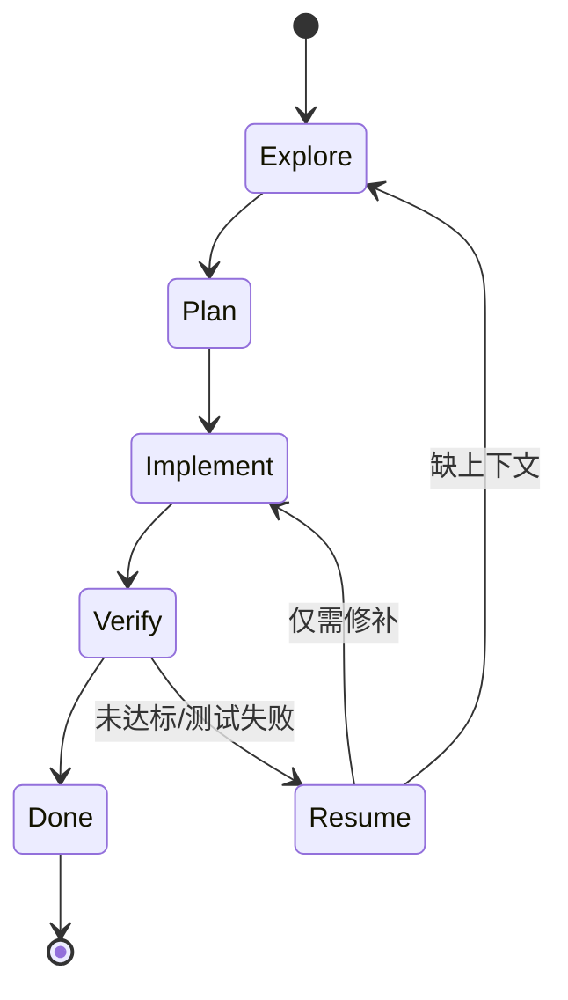

# oh-my-opencode：实现扫描与 Agent 调用 / Prompt SOP

- 仓库主页：https://github.com/code-yeongyu/oh-my-opencode
- 本文关注点：技术实现机制、Agent 调用/编排逻辑、Hook 生命周期、Prompt/触发词（ultrawork/ulw 等）
- 扫描方式：基于仓库公开源码（GitHub Contents API 递归目录 + 解码关键文件内容）

---

## 1. 你在“用的到底是什么”

在实现层面，oh-my-opencode 是一个 OpenCode 插件（Plugin），通过注册一组 handlers + tools 来“接管/增强”一次对话的关键节点：

- tool 注册：扩展可用工具集（含 LSP / AST / 会话 / 命令等工具的组合与过滤）
- chat.params：对模型参数做注入（例如 anthropic effort 的策略）
- chat.message：对消息本体做注入/改写（例如关键词模式注入 ultrawork 指令块）
- event：通过事件流管理会话、后台子会话、tmux session 等
- tool.execute.before / tool.execute.after：在工具执行前后注入守卫/格式化/续跑等机制
- experimental.session.compacting：在会话压缩时捕获 TODO 并注入“压缩上下文”

---

## 2. 仓库模块地图（实现维度）

以目录职责划分（只列与“调用逻辑/Prompt/Hook”强相关的部分）：

- `src/index.ts`：插件入口（装配链起点）
- `src/plugin-config.ts`：配置加载/JSONC 解析/合并与 disabled_* 生效点
- `src/create-managers.ts`：后台任务、tmux、skill MCP 等 manager 装配
- `src/create-tools.ts`：skillContext + toolRegistry 装配（并产出 availableSkills/categories）
- `src/create-hooks.ts` + `src/plugin/hooks/*`：core/continuation/skill hooks 装配
- `src/plugin-interface.ts`：把 handlers（chat.params/chat.message/event/…）挂到插件上
- `src/agents/*`：各类 agent prompt 与元数据（Sisyphus/Hephaestus/Oracle/Librarian/Explore/Prometheus…）
- `src/hooks/*`：具体 hook 实现（keyword-detector、todo-continuation-enforcer、comment-checker…）
- `.opencode/command/*`：仓库自带的 slash commands（供 OpenCode 直接调用）
- `.opencode/skills/*`：仓库自带 skills（提示词注入片段，供 load_skills 组合）
- `.sisyphus/rules/*`：规则/约束（用于塑造编排与代码输出风格）

---

## 3. 插件启动装配链（从代码到调用链）

`src/index.ts` 的装配顺序可以概括为：

- 载入配置：`loadPluginConfig(ctx.directory, ctx)`，并解析 disabled_hooks
- 装配 managers：`createManagers({ ctx, pluginConfig, tmuxConfig, modelCacheState })`
- 装配 tools：`createTools({ ctx, pluginConfig, managers })` → 得到 mergedSkills/availableSkills/availableCategories/filteredTools
- 装配 hooks：`createHooks({ ctx, pluginConfig, backgroundManager, isHookEnabled, safeHookEnabled, mergedSkills, availableSkills })`
- 生成插件接口：`createPluginInterface({ ctx, pluginConfig, firstMessageVariantGate, managers, hooks, tools })`
- 额外挂载：`experimental.session.compacting`（压缩前捕获 todo，压缩时注入 context）

```mermaid
flowchart TD
  A[OpenCode 启动] --> B[oh-my-opencode Plugin(ctx)]
  B --> C[loadPluginConfig\n(user+project JSON/JSONC merge)]
  C --> D[createManagers\n(background/tmux/skill-mcp/config)]
  D --> E[createTools\n(skillContext + toolRegistry)]
  E --> F[createHooks\n(core + continuation + skill)]
  F --> G[createPluginInterface\n(register handlers + tools)]
  G --> H[运行期增强\nchat.params/chat.message/event\n& tool.before/after]
  G --> I[experimental.session.compacting\n(todo capture + context inject)]
```

---

## 4. 配置系统（文件位置、合并规则、禁用开关）

### 4.1 配置文件位置

`loadPluginConfig()` 会按“用户级 → 项目级覆盖”的顺序加载：

- 用户级：OpenCode 配置目录下 `oh-my-opencode.json` 或 `oh-my-opencode.jsonc`
- 项目级：`<project>/.opencode/oh-my-opencode.json` 或 `oh-my-opencode.jsonc`

并且优先 `.jsonc`（支持注释与尾随逗号）高于 `.json`。

- Windows 备注：OpenCode 多数情况下仍遵循 XDG 风格目录；可优先在 `%USERPROFILE%\.config\opencode\` 下查找（以 OpenCode 实际实现/文档为准）。

### 4.2 合并规则（核心）

`mergeConfigs(base, override)` 的关键点：

- `agents`、`categories`：深度合并（deepMerge）
- `disabled_agents/disabled_mcps/disabled_hooks/disabled_commands/disabled_skills`：集合去重后拼回数组
- `claude_code`：深度合并

```mermaid
flowchart LR
  U[User Config\n~/.config/opencode/oh-my-opencode(.jsonc/.json)] --> M[mergeConfigs]
  P[Project Config\n./.opencode/oh-my-opencode(.jsonc/.json)] --> M
  M --> F[Final Config\nagents/categories deepMerge\n disabled_* set union]
```

### 4.3 disabled_hooks 如何影响运行时

`src/index.ts` 会基于 `pluginConfig.disabled_hooks` 生成 `isHookEnabled(name)`，传入 `createHooks()`，再由各 hook factory 决定是否创建对应 hook（并可通过 `safeHookEnabled` 做“安全创建”兜底）。

---

## 5. tools / skills / categories：Prompt 注入的底层机制

### 5.1 createTools 的产物是什么

`createTools()` 负责把“可用能力”结构化：

- `createSkillContext(...)`：汇总 skills（包含 plugin 自带 + 用户/项目自定义），并产出：
  - `mergedSkills`：合并后的 skill 内容（供后续自动 slash command/注入）
  - `availableSkills`：可枚举的技能元信息（用于 prompt 引导与提醒）
  - `browserProvider`、`disabledSkills` 等运行参数
- `createAvailableCategories(pluginConfig)`：把 categories 暴露成可选项（domain-optimized models）
- `createToolRegistry(...)`：按配置过滤/注册工具，产出 `filteredTools` 与 `taskSystemEnabled`

### 5.2 buildAgent：类别默认值 + skill 内容“前置拼接”

`src/agents/agent-builder.ts` 的关键行为：

- 若 agent 声明了 `category`，则可从该 category 注入默认 `model / temperature / variant`（仅当 agent 自身未显式提供时）
- 若 agent 声明了 `skills`，则会 resolve 多个 skills，并将 skill 文本内容“前置拼接”到 agent 的 prompt：

```text
base.prompt = skillContent + "\n\n" + base.prompt
```

这意味着：skills 不只是“可选能力”，而是会真正改变子 agent 的系统指令/行为边界。

---

## 6. Hook 系统（分层装配 + 关键闭环）

`createHooks()` 会组合三类 hook：

- core hooks：`createSessionHooks` + `createToolGuardHooks` + `createTransformHooks`
- continuation hooks：与“不中途退出/自动续跑/恢复”强相关
- skill hooks：与“category/skill 提醒、slash command 自动化”强相关

### 6.1 continuation hooks：保证“任务闭环”的关键

`createContinuationHooks()`（按配置启用）包含：

- `stop-continuation-guard`：控制“停止续跑”的显式闸门
- `compaction-context-injector`：为会话压缩提供注入上下文
- `compaction-todo-preserver`：压缩前 capture TODO（与 `experimental.session.compacting` 配合）
- `todo-continuation-enforcer`：如果 agent 半途退出/遗漏 todo，强制拉回继续执行
- `unstable-agent-babysitter`：不稳定 agent 的兜底/照护
- `background-notification`：后台任务通知
- `atlas`：与更高层编排相关（基于 backgroundManager、agentOverrides 等）



---

## 7. Keyword Detector：ultrawork/ulw 的“实现触发点”

关键词检测并不是“用户自己记得用”，而是一个 hook：`src/hooks/keyword-detector/hook.ts`，挂在 `chat.message` 阶段执行，对 message 文本做“前置注入”。

### 7.1 触发条件与屏蔽条件

检测器核心策略：

- 在匹配前会移除代码块/行内代码（避免样例代码触发模式）
- 会移除 `<system-reminder>` 内容（防止系统自动提示误触发）
- 如果当前 agent 是 planner（Prometheus/plan），会屏蔽 ultrawork 触发（planner 不需要 ultrawork 注入）
- 对 background task session 禁止关键词注入（避免模式污染子会话）
- 对非主会话，仅允许 ultrawork 注入（search/analyze 等只在主会话有效）

### 7.2 触发效果：注入提示块 + 强化 variant

当检测到 `ultrawork|ulw`：

- 如果 `output.message.variant` 未设置，会设为 `"max"`（提升精度）
- 通过 TUI toast 提示“Ultrawork Mode Activated”
- 把模式消息拼到原始 prompt 前面：

```text
<detected keyword messages>

---

<original text>
```

```mermaid
flowchart TD
  A[chat.message] --> B[extractPromptText(parts)]
  B --> C[removeSystemReminders + removeCodeBlocks]
  C --> D[detectKeywordsWithType]
  D --> E{planner agent?}
  E -- yes --> F[过滤 ultrawork]
  E -- no --> G{background session?}
  G -- yes --> H[跳过注入]
  G -- no --> I{非主会话?}
  I -- yes --> J[仅保留 ultrawork]
  I -- no --> K[保留 ultrawork/search/analyze]
  K --> L{含 ultrawork?}
  L -- yes --> M[variant=max + toast]
  L -- no --> N[仅注入模式文本]
  M --> O[拼接注入块到原始文本前]
  N --> O
```

### 7.3 ultrawork 注入文本如何“按模型分流”

`src/hooks/keyword-detector/ultrawork/index.ts` 会根据 agent/model 选择不同版本的 ultrawork 指令块：

- planner agent → `planner.ts`（强调“只能规划，禁止实现”，并要求输出并行 task graph）
- GPT 模型 → `gpt5.2.ts`
- 其他默认（Claude 等）→ `default.ts`（更强调并行探索、计划、委派与验证闭环）

```mermaid
flowchart TD
  A[getUltraworkMessage(agentName, modelID)] --> B{isPlannerAgent?}
  B -- yes --> C[planner.ts]
  B -- no --> D{isGptModel?}
  D -- yes --> E[gpt5.2.ts]
  D -- no --> F[default.ts]
```

---

## 8. Agent 编排：从“理念”到“可执行调用契约”

从实现可以看到，oh-my-opencode 的“编排”不是玄学，至少包括三层强约束：

1. **模式注入层**：keyword-detector 在 chat.message 里把 ultrawork/搜索/分析模式“写进 prompt”
2. **能力清单层**：dynamic-agent-prompt-builder 自动生成“工具/agent/skill/category 的选择协议”，并要求对 omission 给出 justification
3. **续跑闭环层**：continuation hooks（todo-continuation-enforcer + stop guard + compaction todo preserver）让任务“不容易半途而废”

### 8.1 Category + Skills 选择协议（关键）

`dynamic-agent-prompt-builder.ts` 内置了一个非常强的 delegation 规约：

- 先选 category（决定 domain optimized model）
- 再评估所有 skills（包含用户自装 skills，且用户 skills 具有 HIGH PRIORITY）
- 如果不加载“可能相关”的 skill，必须给出 SKILL EVALUATION（解释为什么域不重叠）

这会直接反映到你写 prompt 时的 task 调用格式。

---

## 9. SOP：可直接复用的 Prompt 模板（以实现机制为准）

下面的模板不是“建议”，而是贴合本仓库实现（关键词注入 + agent/skill/category 协议 + 续跑闭环）的可操作版本。

### 9.1 ultrawork/ulw：开启强编排与强验证

把 `ulw` 放进自然语言里即可触发（keyword-detector 会注入模式块）：

```text
ulw
目标：<一句话目标>
验收标准：<可验证的输出/测试/截图/日志>
上下文：<仓库/目录/关键文件/约束>
禁止项：<不要做什么>
```

### 9.2 并行探索：Explore + Librarian（后台）

当任务需要“先摸清代码/外部资料”时，用并行子 agent（这也是 ultrawork 默认强调的路径）：

```text
task(subagent_type="explore", load_skills=[], prompt="<要在代码库里查的具体点>", run_in_background=true)
task(subagent_type="librarian", load_skills=[], prompt="<要查官方文档/OSS实现的具体点>", run_in_background=true)
```

### 9.3 实现任务：Category + load_skills（把技能真正注入 prompt）

```text
task(
  category="<selected-category>",
  load_skills=["skill-1","skill-2"],
  prompt="<实现说明 + 修改范围 + 验证方式>"
)
```

### 9.4 Planner（Prometheus/plan）会话连续性

ultrawork 的默认消息强调：非平凡任务必须先走 plan agent，并复用 session_id 连续对话：

```text
task(subagent_type="plan", load_skills=[], prompt="<已收集的上下文 + 用户需求>")

task(session_id="<plan返回的session_id>", load_skills=[], prompt="<回答规划器追问/要求补充的上下文>")
```

---

## 10. 参考（建议从这些文件开始读）

- 插件入口与装配链：`src/index.ts`
- 配置加载与合并：`src/plugin-config.ts`
- managers 装配（background/tmux）：`src/create-managers.ts`
- tools/skills/categories 装配：`src/create-tools.ts`
- hooks 装配：`src/create-hooks.ts`、`src/plugin/hooks/create-*.ts`
- agent prompt 拼装（category/skills 注入）：`src/agents/agent-builder.ts`
- 关键词与 ultrawork 实现：`src/hooks/keyword-detector/*`
- category+skills 选择协议生成器：`src/agents/dynamic-agent-prompt-builder.ts`
