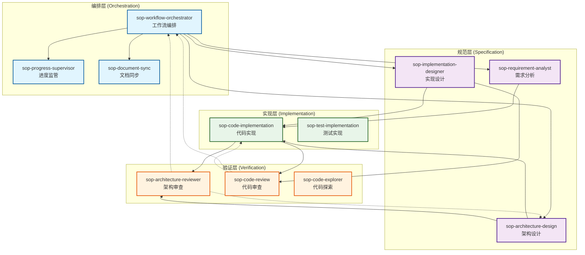
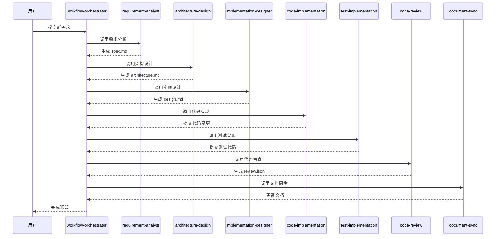
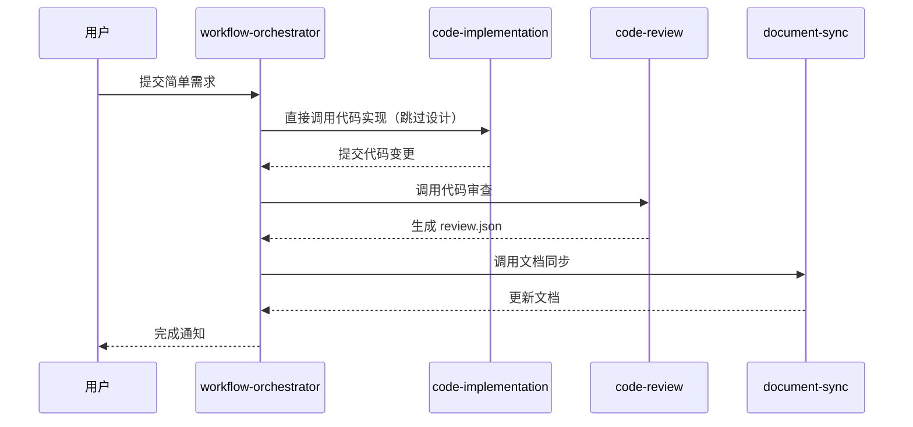

# SOP Skill 依赖关系图

## 系统架构总览

## 分层说明

### 编排层 (Orchestration)

**职责**：管理工作流状态和阶段转换

| Skill | 职责 | 依赖关系 |
|-------|------|----------|
| **sop-workflow-orchestrator** | 工作流编排核心，管理阶段转换 | → 所有 Skill（调度） |
| **sop-progress-supervisor** | 监控进度，报告阻塞问题 | ← workflow-orchestrator |
| **sop-document-sync** | 同步代码与文档 | ← workflow-orchestrator |

### 规范层 (Specification)

**职责**：生成规范文档，定义系统行为

| Skill | 职责 | 依赖关系 |
|-------|------|----------|
| **sop-requirement-analyst** | 需求分析，生成 BDD 场景 | ← workflow-orchestrator |
| **sop-architecture-design** | 架构设计，定义分层和模块 | ← requirement-analyst |
| **sop-implementation-designer** | 详细设计，定义类和方法 | ← architecture-design |

### 实现层 (Implementation)

**职责**：将规范转换为代码和测试

| Skill | 职责 | 依赖关系 |
|-------|------|----------|
| **sop-code-implementation** | 实现业务逻辑代码 | ← implementation-designer |
| **sop-test-implementation** | 实现单元测试和集成测试 | ← code-implementation |

### 验证层 (Verification)

**职责**：验证实现是否符合规范

| Skill | 职责 | 依赖关系 |
|-------|------|----------|
| **sop-architecture-reviewer** | 审查架构符合性 | ← architecture-design |
| **sop-code-review** | 审查代码质量和规范 | ← code-implementation |
| **sop-code-explorer** | 分析现有代码库 | 独立（只读） |

## 工作流执行路径

### 标准工作流（Heavy 路径）

### 快速工作流（Fast 路径）

## Skill 调用矩阵

| 调用方 | 被调用方 | 调用场景 |
|--------|----------|----------|
| workflow-orchestrator | requirement-analyst | Stage 1: 需求分析 |
| workflow-orchestrator | architecture-design | Stage 1: 架构设计 |
| workflow-orchestrator | implementation-designer | Stage 1: 实现设计 |
| workflow-orchestrator | code-implementation | Stage 2: 代码实现 |
| workflow-orchestrator | test-implementation | Stage 2: 测试实现 |
| workflow-orchestrator | code-review | Stage 2: 代码审查 |
| workflow-orchestrator | document-sync | Stage 3: 文档同步 |
| workflow-orchestrator | progress-supervisor | 进度查询 |
| architecture-design | requirement-analyst | 参考现有规范 |
| implementation-designer | architecture-design | 参考架构设计 |
| code-implementation | implementation-designer | 参考设计文档 |
| test-implementation | requirement-analyst | 参考 BDD 场景 |
| code-review | code-implementation | 审查代码变更 |
| architecture-reviewer | architecture-design | 审查架构文档 |
| code-explorer | 所有 | 探索代码库（只读） |

## 依赖关系规则

### 依赖方向

1. **外层依赖内层**：实现层依赖规范层，验证层依赖实现层
2. **禁止跨层调用**：不能跳过直接依赖层调用其他层
3. **禁止循环依赖**：依赖关系必须是有向无环图（DAG）

### 例外情况

- **反馈回路**：验证层可以向编排层反馈，触发重新执行
- **只读访问**：code-explorer 可以访问任何层的代码（不修改）

## 版本历史

| 版本 | 日期 | 变更说明 |
|------|------|----------|
| v1.0 | 2026-03-01 | 初始版本，包含 11 个 Skill 依赖关系 |
