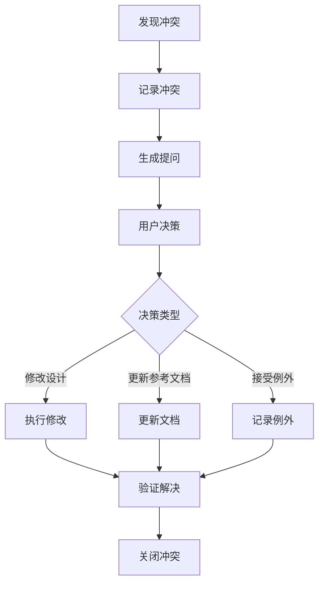

# ADR-Spec-004: 持久化交互式提问机制核心决策

## 状态

- [x] 已接受
- [ ] 已废弃
- [ ] 已替代

## 0. 来源与依赖声明

| 类型 | 来源 | 说明 |
|------|------|------|
| 输入 | 用户需求 | 持久化交互式提问机制核心决策 |
| 依赖 | spec_interactive_guide.md | Spec 设计阶段交互式提问指南（整合版） |
| 关联 | adr_Spec_001_lifecycle.md | Spec 产物生命周期管理 |
| 关联 | adr_Spec_002_design_relation.md | Spec 与 Design.md 关系定义 |
| 关联 | adr_Spec_003_version_sync.md | 版本同步机制 |

## 背景 (Context)

### 问题描述

当前 Spec 设计阶段的交互式提问机制缺乏持久化决策记录，存在以下问题：

1. **决策不可追溯**：用户在交互过程中的决策未形成持久化记录，后续无法追溯
2. **冲突处理不一致**：不同设计阶段的冲突检测和处理方式缺乏统一标准
3. **检查清单未强制执行**：检查清单作为参考文档，未形成强制执行机制
4. **证据引用不规范**：提问依据的文档引用缺乏统一格式

### 约束条件

- 必须保持与现有 ADR 体系的一致性
- 必须支持即时提问原则
- 必须确保决策可追溯
- 必须与 ADR-Spec-001/002/003 建立引用关系

### 影响范围

- `sop/04_reference/spec_interactive_guide.md`
- `docs/04_context_reference/adr_*.md`

## 决策 (Decision)

### 选择的方案

**方案 A：建立持久化交互式提问机制核心决策体系**

定义 8 项核心决策（D1-D8），覆盖提问触发、格式规范、冲突处理、决策记录全流程。

### 决策理由

将交互式提问机制的核心决策持久化为 ADR，确保设计决策可追溯、冲突处理有章可循、检查清单强制执行。

---

## 核心决策 (Core Decisions)

### D1: 章节级检测机制

**决策内容**：在 Spec 设计章节编写完成后立即触发检测，而非等待整个设计文档完成。

**检测节点定义**：

| 设计阶段 | 检测节点 | 触发条件 |
|----------|----------|----------|
| **L2 架构设计** | 技术选型章节 | 引入新依赖/框架/服务 |
| **L2 架构设计** | 接口定义章节 | 定义跨模块接口/公共 API |
| **L2 架构设计** | 数据流章节 | 涉及数据存储/传输变更 |
| **L3 实现设计** | 技术规格章节 | 具体技术实现方案选择 |
| **L3 实现设计** | 接口契约章节 | 函数签名/数据结构定义 |

**检测范围**：

```
检测范围
├── ADR 文档 (docs/04_context_reference/adr_*.md)
│   ├── 已接受决策 → 强制合规
│   ├── 提议中决策 → 需确认一致性
│   └── 已废弃决策 → 检查是否重新激活
├── 设计文档 (docs/02_logical_workflow/*.md)
│   ├── 架构边界定义
│   └── 模块职责划分
└── 约束矩阵 (docs/05_constraints/*.md)
    ├── 安全红线
    ├── 性能基线
    └── 兼容性要求
```

---

### D2: 即时提问原则

**决策内容**：检测到冲突时必须立即提问，不得延后到后续阶段。

**即时提问流程**：

```
设计过程
    ↓
【检测点】章节内容变更
    ↓
【扫描】ADR/设计文档/约束矩阵
    ↓
【判断】是否存在冲突/歧义/缺失？
    ├─ 否 → 继续设计
    └─ 是 → 【触发提问】
              ↓
         【格式化提问】
              ↓
         【等待用户响应】
              ↓
         【处理响应】
              ├─ 确认 → 更新设计/ADR
              ├─ 拒绝 → 回滚/调整方案
              └─ 补充信息 → 重新评估
```

**约束**：禁止跳过冲突检测继续设计，禁止批量积累问题后统一提问。

---

### D3: 结构化选项要求

**决策内容**：提问必须提供结构化选项，不得仅开放问答。

**提问格式规范**：

```markdown
## 设计确认请求

### 检测到的冲突/问题
**类型**: [冲突类型]
**位置**: [设计文档章节]
**描述**: [具体问题描述]

### 相关约束/决策
> 引用: [ADR-XXX](../04_context_reference/adr_xxx.md) 或 [约束文档](../05_constraints/xxx.md)
> 要求: [约束/决策的具体要求]

### 当前设计内容
[展示当前设计的相关部分]

### 请选择处理方式
- **A. [方案名称]**: [方案描述]
  - 影响: [对现有系统的影响]
  - 风险: [潜在风险]
  
- **B. [方案名称]**: [方案描述]
  - 影响: [对现有系统的影响]
  - 风险: [潜在风险]
  
- **C. 自定义方案**: 请描述您的方案

**推荐**: [A/B] (理由: [推荐理由])
```

**选项设计原则**：

| 原则 | 说明 | 示例 |
|------|------|------|
| **完整性** | 选项应覆盖主要可行方案 | 不遗漏明显合理的选项 |
| **互斥性** | 各选项之间应相互独立 | 避免选项A包含选项B |
| **可比较性** | 选项应使用相同的评估维度 | 都包含影响/风险/成本 |
| **可操作性** | 每个选项应可直接执行 | 不需要额外解释 |
| **默认推荐** | 提供基于最佳实践的推荐 | 标注推荐选项及理由 |

---

### D4: 冲突优先级处理

**决策内容**：多冲突时必须按优先级顺序处理，高优先级冲突解决后再处理低优先级。

**优先级矩阵**：

| 优先级 | 影响范围 | 冲突类型 | 处理时限 |
|--------|----------|----------|----------|
| **P0** | 系统级 | 安全红线/数据丢失风险 | 立即阻断 |
| **P1** | 模块级 | 架构边界/接口兼容性 | 当前章节完成前 |
| **P2** | 功能级 | 性能/可维护性影响 | 设计阶段结束前 |
| **P3** | 代码级 | 实现细节/风格问题 | 可延后至实现阶段 |

**多冲突处理流程**：

1. **冲突收集**：按优先级排序并汇总
2. **批量提问**：按优先级从高到低，一次提问一个冲突
3. **影响链分析**：解决高优先级冲突后，检查是否影响低优先级冲突

---

### D5: ADR 更新三选项

**决策内容**：当设计决策需要更新现有 ADR 时，提供三个标准选项。

**三选项定义**：

| 选项 | 处理动作 | 后续步骤 |
|------|----------|----------|
| **确认更新** | 更新 ADR 文档 | 继续设计，记录变更日志 |
| **拒绝更新** | 回滚设计变更 | 重新设计方案以符合现有 ADR |
| **创建新 ADR** | 创建新 ADR 文档 | 新 ADR 引用原 ADR，说明替代关系 |

**更新预览格式**：

```markdown
## ADR 更新确认

### 目标 ADR
**文档**: [ADR-XXX: 标题](../04_context_reference/adr_xxx.md)
**当前状态**: [已接受/提议中]

### 变更预览
| 章节 | 变更前 | 变更后 |
|------|--------|--------|
| [章节名] | [原内容] | [新内容] |

### 变更原因
[说明为什么需要此变更]

### 影响评估
- **影响范围**: [受影响的模块/系统]
- **兼容性**: [是否向后兼容]
- **迁移成本**: [需要的迁移工作]
```

---

### D6: 决策分级记录

**决策内容**：所有用户决策必须按分级标准记录到相应位置。

**分级标准**：

| 级别 | 判定条件 | 记录位置 | 记录格式 |
|------|----------|----------|----------|
| **重要决策** | 引入新依赖/变更架构/影响安全/影响多模块 | ADR | 完整 ADR 格式 |
| **一般决策** | 单模块实现方案/接口设计/数据结构 | spec.md | 决策记录章节 |
| **轻微决策** | 代码风格/命名规范/工具选择 | 代码注释 | 简要说明 |

**一般决策记录格式**：

```markdown
## 决策记录

### [决策主题]
- **决策时间**: [日期]
- **决策内容**: [具体决策]
- **决策理由**: [简要理由]
- **影响范围**: [受影响范围]
- **相关 ADR**: [ADR 链接，如有]
```

---

### D7: 检查清单强制执行

**决策内容**：每个设计章节完成后必须执行检查清单，不得跳过。

**检查维度与检查项**：

#### 架构一致性检查 (A1-A5)

| 序号 | 检查项 | 检查要点 |
|------|--------|----------|
| A1 | 是否与现有 L2 架构设计一致？ | 对照现有架构图确认模块归属 |
| A2 | 是否需要修改现有架构设计？ | 验证数据流向与现有设计一致 |
| A3 | 是否引入新的架构模式？ | 确认接口设计符合架构规范 |
| A4 | 是否影响系统边界？ | 评估对整体架构的影响范围 |
| A5 | 是否影响模块间通信？ | 检查模块间接口变更 |

#### ADR 合规性检查 (D1-D5)

| 序号 | 检查项 | 检查要点 |
|------|--------|----------|
| D1 | 是否与现有 ADR 冲突？ | 检索相关 ADR 文档列表 |
| D2 | 是否需要创建新 ADR？ | 对比决策与现有 ADR 内容 |
| D3 | 是否需要废弃现有 ADR？ | 识别需要新增或变更的 ADR |
| D4 | 是否需要更新现有 ADR？ | 确保决策过程可追溯 |
| D5 | 决策是否有据可查？ | 验证决策依据文档完整性 |

#### 性能影响检查 (P1-P5)

| 序号 | 检查项 | 检查要点 |
|------|--------|----------|
| P1 | 是否引入性能瓶颈？ | 评估算法时间复杂度 |
| P2 | 是否需要性能优化策略？ | 分析数据量增长影响 |
| P3 | 是否影响现有性能指标？ | 考虑并发场景性能 |
| P4 | 是否增加资源消耗？ | 评估内存和存储消耗 |
| P5 | 是否影响响应时间？ | 识别潜在热点路径 |

#### 安全风险检查 (S1-S5)

| 序号 | 检查项 | 检查要点 |
|------|--------|----------|
| S1 | 是否引入安全漏洞？ | 检查输入验证和数据清洗 |
| S2 | 是否需要安全审查？ | 评估认证授权机制 |
| S3 | 是否影响现有安全机制？ | 识别敏感数据流向 |
| S4 | 是否涉及敏感数据处理？ | 检查日志脱敏需求 |
| S5 | 是否需要权限控制？ | 评估第三方依赖安全 |

#### 可维护性检查 (M1-M5)

| 序号 | 检查项 | 检查要点 |
|------|--------|----------|
| M1 | 是否增加代码复杂度？ | 评估圈复杂度变化 |
| M2 | 是否需要重构现有代码？ | 检查代码重复情况 |
| M3 | 是否引入技术债务？ | 评估测试覆盖需求 |
| M4 | 是否影响代码可读性？ | 确认命名规范一致性 |
| M5 | 是否需要更新文档？ | 评估文档更新范围 |

#### 兼容性检查 (C1-C5)

| 序号 | 检查项 | 检查要点 |
|------|--------|----------|
| C1 | 是否影响现有 API 兼容性？ | 检查 API 签名变更 |
| C2 | 是否需要数据迁移？ | 评估数据结构变更影响 |
| C3 | 是否影响现有配置？ | 确认配置项兼容性 |
| C4 | 是否影响第三方集成？ | 评估集成接口稳定性 |
| C5 | 是否需要版本兼容处理？ | 规划版本过渡策略 |

**检查结果处理**：

| 结论 | 处理方式 |
|------|----------|
| 通过 | 记录结论，继续后续流程 |
| 待定 | 标记待确认项，明确确认责任人和时间 |
| 需处理 | 制定具体处理计划，跟踪处理进度 |

---

### D8: 证据引用强制

**决策内容**：提问必须引用相关 ADR/约束文档作为依据，不得无据提问。

**引用格式**：

```markdown
### 相关约束/决策
> 引用: [ADR-XXX](../04_context_reference/adr_xxx.md)
> 要求: [约束/决策的具体要求]
> 章节: [相关章节链接]
```

**引用来源类型**：

| 来源类型 | 路径模式 | 引用优先级 |
|----------|----------|------------|
| ADR 文档 | `docs/04_context_reference/adr_*.md` | 最高 |
| 约束矩阵 | `sop/05_constraints/*.md` | 高 |
| 设计文档 | `docs/02_logical_workflow/*.md` | 中 |
| 规范文档 | `sop/04_reference/*.md` | 中 |

---

## 冲突检测核心规则

### 检测范围定义

| 检测对象 | 路径模式 | 检测时机 |
|----------|----------|----------|
| ADR 文档 | `docs/04_context_reference/adr_*.md` | 章节完成后 |
| 设计文档 | `**/design.md` | 章节完成后 |
| 逻辑工作流 | `docs/02_logical_workflow/*.md` | 章节完成后 |
| 约束矩阵 | `sop/05_constraints/constraint_matrix.md` | 章节完成后 |

### 冲突类型分类

#### ADR 冲突类型

| 类型 | 定义 | 示例 |
|------|------|------|
| **直接矛盾** | 新设计与 ADR 决策直接相反 | ADR 决定使用技术栈 A，新设计使用技术栈 B |
| **隐含矛盾** | 新设计隐含违反 ADR 约束 | ADR 规定了性能基准，新设计无法达到 |
| **过时引用** | ADR 已过时但新设计仍引用 | 引用已废弃的技术选型 |

#### 设计文档冲突类型

| 类型 | 定义 | 示例 |
|------|------|------|
| **接口不一致** | 函数签名/API 端点定义冲突 | 参数类型或数量不一致 |
| **数据模型不一致** | 数据结构定义冲突 | 字段类型不匹配 |
| **依赖关系不一致** | 模块依赖方向矛盾 | 循环依赖 |

#### 约束矩阵冲突类型

| 类型 | 定义 | 示例 |
|------|------|------|
| **违反禁止项** | 使用被禁止的技术或工具 | 采用被禁止的设计模式 |
| **越权操作** | 超出角色权限的操作 | 跨越模块边界的访问 |
| **流程违规** | 跳过必需的审批流程 | 缺失必要的检查步骤 |

### 冲突处理流程



---

## 选项对比 (Options Considered)

| 选项 | 优点 | 缺点 | 适用场景 |
|------|------|------|----------|
| **方案A: 持久化决策体系** (已选择) | 决策可追溯、流程规范化、强制执行 | 需要额外记录工作 | 正式项目 |
| 方案B: 临时提问机制 | 灵活、无额外工作 | 决策不可追溯 | 小型项目 |
| 方案C: 批量确认机制 | 减少交互次数 | 问题积累、风险延迟 | 不推荐 |

---

## 影响 (Consequences)

### 正面影响

- 决策可追溯，支持历史回溯
- 冲突处理有章可循，减少遗漏
- 检查清单强制执行，提升设计质量
- 证据引用规范，提问有据可依

### 负面影响/风险

- 增加交互频率 → 通过结构化选项减少往返
- 增加记录工作 → 通过模板和自动化缓解

### 技术债务

- 无

---

## 与其他 ADR-Spec 的关系

### 引用关系图

```
ADR-Spec-004 (交互式提问机制)
    │
    ├── 引用 ──► ADR-Spec-001 (生命周期管理)
    │              └── 提问决策的持久化存储位置
    │
    ├── 引用 ──► ADR-Spec-002 (Design.md 关系)
    │              └── 检测范围和任务边界定义
    │
    └── 引用 ──► ADR-Spec-003 (版本同步)
                   └── 决策文档版本一致性
```

### 协作关系

| ADR | 协作内容 |
|-----|----------|
| ADR-Spec-001 | 提问决策归档至 `docs/04_context_reference/` |
| ADR-Spec-002 | 检测范围按 design.md 目录边界划分 |
| ADR-Spec-003 | 决策文档版本与 CHANGELOG 保持同步 |

---

## 相关文档

- **交互式提问指南**: [spec_interactive_guide.md](04_reference/spec_interactive_guide.md)
- **ADR 模板**: [document_templates/adr.md](04_reference/document_templates/adr.md)
- **ADR-Spec-001**: [adr_Spec_001_lifecycle.md](adr_Spec_001_lifecycle.md)
- **ADR-Spec-002**: [adr_Spec_002_design_relation.md](adr_Spec_002_design_relation.md)
- **ADR-Spec-003**: [adr_Spec_003_version_sync.md](adr_Spec_003_version_sync.md)

---

## 决策变更记录

| 日期 | 变更类型 | 原决策 | 新决策 | 触发任务 | 决策人 |
|------|----------|--------|--------|----------|--------|
| 2026-02-22 | 新增 | - | D1-D8 核心决策 | adr-Spec-004 | sop-implementation-designer |

---

## 决策记录

| 日期 | 决策人 | 动作 | 说明 |
|------|--------|------|------|
| 2026-02-22 | sop-implementation-designer | 创建 | 定义持久化交互式提问机制核心决策 |
