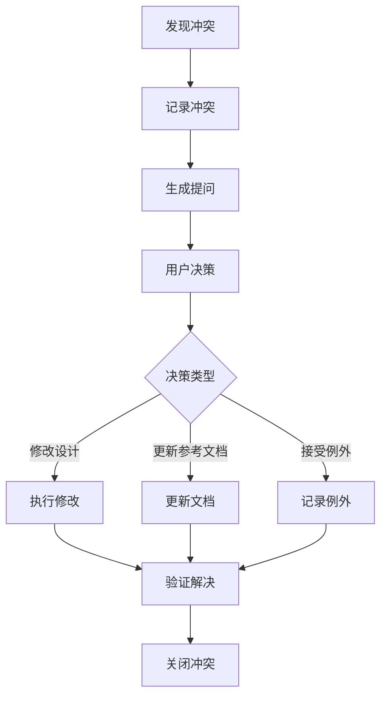

# 设计冲突检测规则

## 概述

本文档定义了 OpenSpec 项目中设计冲突检测的规则和流程。旨在确保新设计与现有架构决策记录（ADR）、设计文档和约束矩阵保持一致，避免设计矛盾和潜在问题。

本文档适用于：
- spec.md 章节编写完成后的冲突检测
- 设计评审过程中的冲突识别
- 约束验证和一致性检查

## ADR 冲突检测逻辑

### 检测范围

- `docs/04_context_reference/adr_*.md`

### 检测时机

spec.md 章节编写完成后执行。

### 冲突类型定义

#### 直接矛盾

新设计与 ADR 决策直接相反，例如：
- ADR 决定使用技术栈 A，新设计使用技术栈 B
- ADR 禁止某项实践，新设计采用该实践
- ADR 定义的数据格式与新设计不兼容

#### 隐含矛盾

新设计隐含违反 ADR 约束，例如：
- ADR 规定了性能基准，新设计无法达到
- ADR 定义了安全要求，新设计存在安全隐患
- ADR 约定了模块边界，新设计跨越边界

#### 过时引用

ADR 已过时但新设计仍引用，例如：
- 引用已废弃的技术选型
- 引用已变更的架构决策
- 引用已删除的模块或接口

### 检测方法

#### 关键词匹配

- 提取 ADR 中的决策关键词
- 与新设计内容进行匹配
- 识别相互矛盾的关键词对

#### 语义分析

- 分析 ADR 决策的语义含义
- 与新设计的语义进行对比
- 识别语义层面的冲突

#### 依赖关系检查

- 检查新设计对 ADR 的依赖
- 验证依赖的有效性和时效性
- 识别循环依赖或断裂依赖

## 设计文档冲突检测逻辑

### 检测范围

- `**/design.md`
- `docs/02_logical_workflow/*.md`

### 冲突类型定义

#### 接口不一致

- 函数签名不匹配
- API 端点定义冲突
- 参数类型或数量不一致
- 返回值格式不兼容

#### 数据模型不一致

- 数据结构定义冲突
- 字段类型不匹配
- 必填/可选属性矛盾
- 约束条件冲突

#### 依赖关系不一致

- 模块依赖方向矛盾
- 循环依赖
- 缺失依赖声明
- 版本约束冲突

### 检测方法

- 接口签名对比分析
- 数据模型 Schema 验证
- 依赖图谱构建与检查
- 版本兼容性分析

## 约束矩阵冲突检测逻辑

### 检测范围

- `sop/05_constraints/constraint_matrix.md`

### 冲突类型定义

#### 违反禁止项

- 使用被禁止的技术或工具
- 采用被禁止的设计模式
- 执行被禁止的操作流程

#### 越权操作

- 超出角色权限的操作
- 跨越模块边界的访问
- 违反数据访问控制

#### 流程违规

- 跳过必需的审批流程
- 违反规定的执行顺序
- 缺失必要的检查步骤

### 检测方法

- 禁止项清单匹配
- 权限矩阵验证
- 流程状态机检查
- 合规性审计

## 冲突优先级规则

| 优先级 | 影响范围 | 处理时限 | 示例 |
|--------|----------|----------|------|
| P0 | 影响全局架构 | 立即处理 | 核心技术栈冲突、安全架构冲突 |
| P1 | 影响多个模块 | 24小时内 | 跨模块接口冲突、共享数据模型冲突 |
| P2 | 影响单个模块 | 3天内 | 模块内部设计冲突、局部接口变更 |
| P3 | 影响单个文件 | 1周内 | 文档描述冲突、命名不一致 |

## 冲突处理流程

### 详细步骤

1. **发现冲突**：通过检测机制识别潜在冲突
2. **记录冲突**：在冲突日志中记录详细信息
3. **生成提问**：向用户生成明确的冲突确认提问
4. **用户决策**：用户选择处理方式
5. **执行决策**：根据用户选择执行相应操作

## 相关文档引用

- [设计决策规则](design_decision_rules.md)
- [文档目录映射](document_directory_mapping.md)
- [设计评审标准](review_standards/design_review.standard.md)
- [约束矩阵](../05_constraints/constraint_matrix.md)
