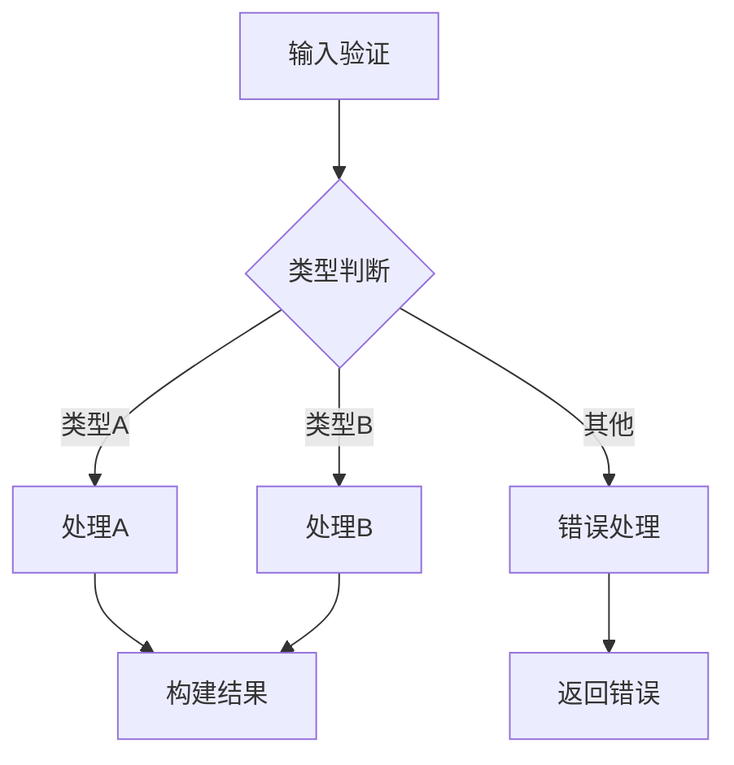
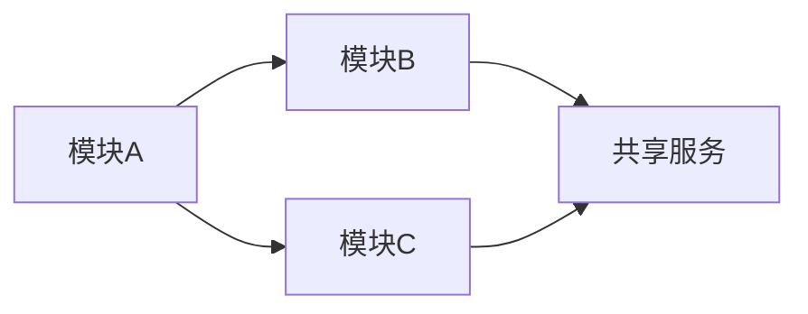

# 架构设计模板 (L2: 逻辑工作流)

**层级**: L2 - 逻辑工作流  
**位置**: `docs/02_logical_workflow/[module].md`  
**创建者**: sop-architecture-design  
**规范**: 技术无关，只描述逻辑，不写实现

---

## 质量门控检查清单

> 在完成本阶段设计后，必须确认以下检查项：

| 检查项 | 通过标准 | 状态 |
|--------|----------|------|
| 架构图清晰 | 逻辑流程图/模块关系图可读 | [ ] |
| 接口定义完整 | 输入/输出/错误码定义完整 | [ ] |
| 与现有系统无冲突 | 不与现有架构/ADR冲突 | [ ] |
| 设计可行 | 技术方案可实现 | [ ] |
| 决策有依据 | 关键决策有ADR或RAG支撑 | [ ] |
| 伪代码格式规范 | 使用标准Markdown格式，分层级描述 | [ ] |

**门控失败处理**：若任一检查项未通过，应记录失败原因并返回修正。

---

## 架构图建议（可选）

> 对于复杂模块，建议使用mermaid绘制架构图：

### 逻辑流程图示例



### 模块依赖关系图示例



---

## 文件结构

~~~markdown
# [模块] 逻辑设计

## 1. 核心概念

### 0. 来源与依赖声明
> 必须引用 [Source and Dependency](04_reference/interaction_formats/source_dependency.md) 标准格式

- 定义: [一句话定义]
- 痛点: [解决什么问题]
- 术语: [关键术语定义]

## 2. 逻辑流程 (伪代码)

### 2.1 模块层：[模块名称]

**职责**：[一句话描述模块职责]  
**边界**：[模块边界说明]

### 2.2 流程层：主流程

```text
// 主流程：处理用户请求
FUNCTION main(input):
    // 输入验证是必要的前置条件
    VALIDATE_INPUT input
    
    IF input.type == "A":
        result = process_type_a(input)
    ELSE IF input.type == "B":
        result = process_type_b(input)
    ELSE:
        RAISE_ERROR "Invalid type"
    END IF
    
    RETURN result
END FUNCTION
```

### 2.3 流程层：子流程A

```text
// 子流程A：处理类型A数据
FUNCTION process_type_a(data):
    // 预处理确保数据格式统一
    normalized = PREPROCESS_DATA(data)
    
    FOR EACH item IN normalized.items:
        TRANSFORM_ITEM item
    END FOR
    
    RETURN BUILD_RESULT(normalized)
END FUNCTION
```

## 3. 接口契约
### 输入
| 字段 | 类型 | 必填 | 说明 |
|------|------|------|------|
| field | String | 是 | [说明] |

### 输出
| 字段 | 类型 | 说明 |
|------|------|------|
| result | Object | [说明] |

### 错误码
| 码 | 说明 | 处理 |
|----|------|------|
| E001 | [说明] | [处理] |

## 4. 选型调研（候选方案对比）
| 决策点 | 候选方案 | 适用场景 | 约束/风险 | 运维复杂度 | 结论 |
|--------|----------|----------|-----------|------------|------|
| [主题] | A / B | [场景] | [风险] | [高/中/低] | [结论/待决策] |

## 5. 参考资料（RAG）
| 来源 | 类型 | 内容摘要 | 链接 |
|------|------|----------|------|
| [20260211_xxx] | 外部知识/用户输入 | [摘要] | [rag/external/... 或 rag/user_input/...] |

## 6. 设计决策 (ADR摘要)
| 决策 | 选项 | 选择 | 理由 | 证据 |
|------|------|------|------|------|
| [主题] | A/B | [选择] | [一句话理由] | [RAG/ADR链接] |

👉 ADR 位置：`docs/04_context_reference/adr_[module]_[decision].md`（参见 04_reference/document_directory_mapping.md）
~~~

---

## 伪代码规范 (L2层)

### 格式要求

| 要求 | 说明 |
|------|------|
| 代码块格式 | 使用标准 Markdown 代码块，语言标识符为 `text` 或省略 |
| 缩进规范 | 使用 4 空格缩进，保持层级清晰 |
| 语言无关 | 不依赖特定编程语言语法 |

### 分层级描述结构

| 层级 | 描述方式 | 命名规范 | 示例 |
|------|----------|----------|------|
| 模块层 | Markdown 标题标识模块名称和职责 | - | `### 2.1 模块层：用户认证` |
| 流程层 | 函数定义包裹主流程 | `lower_snake_case` | `FUNCTION process_request():` |
| 操作层 | 原子操作调用 | `UPPER_SNAKE_CASE` | `VALIDATE_INPUT input` |

### 命名规范

| 类型 | 格式 | 示例 |
|------|------|------|
| 原子操作 | `UPPER_SNAKE_CASE` | `VALIDATE_INPUT` |
| 函数 | `lower_snake_case` | `process_data` |
| 常量 | `UPPER_SNAKE_CASE` | `MAX_RETRY_COUNT` |
| 变量 | `lower_snake_case` | `user_input` |

### 控制结构

#### 条件结构

```text
IF condition:
    action
ELSE IF other_condition:
    other_action
ELSE:
    default_action
END IF
```

#### 循环结构

```text
FOR EACH item IN collection:
    process(item)
END FOR

WHILE condition:
    action
END WHILE
```

#### 异常处理结构

```text
TRY:
    operation
CATCH error_type:
    handle_error
END TRY
```

#### 函数定义

```text
FUNCTION function_name(param1, param2):
    // 函数体
    RETURN result
END FUNCTION
```

### 注释规范

- 注释说明"为什么"，而非"是什么"
- 复杂逻辑前添加意图说明
- 涉及架构决策时引用 ADR

```text
// 好：说明为什么需要过滤
// 过滤已删除项目，避免处理无效数据
// ADR-001: 采用软删除策略
FOR EACH item IN items:
    IF item.status == "deleted":
        CONTINUE
    END IF
END FOR

// 不好：描述做了什么
// 遍历items，如果status是deleted就跳过
```

### 完整示例

```text
// ============================================
// 模块：订单处理模块
// 职责：处理订单创建、更新、取消等核心流程
// ============================================

// 主流程：创建订单
FUNCTION create_order(user_id, items):
    // 验证用户状态，确保用户可下单
    user = GET_USER(user_id)
    IF user.status != "active":
        RAISE_ERROR "USER_INACTIVE"
    END IF
    
    // 验证库存，避免超卖
    FOR EACH item IN items:
        stock = CHECK_STOCK(item.product_id, item.quantity)
        IF stock < item.quantity:
            RAISE_ERROR "INSUFFICIENT_STOCK"
        END IF
    END FOR
    
    // 创建订单记录
    order = CREATE_ORDER_RECORD(user_id, items)
    
    // 扣减库存
    FOR EACH item IN items:
        DEDUCT_STOCK(item.product_id, item.quantity)
    END FOR
    
    // 发送通知
    SEND_ORDER_NOTIFICATION(user_id, order.id)
    
    RETURN order
END FUNCTION

// 子流程：检查库存
FUNCTION check_stock(product_id, quantity):
    product = GET_PRODUCT(product_id)
    RETURN product.stock - quantity
END FUNCTION
```

---

## L2层约束

✅ **必须**:
- 使用 Markdown 文档描述逻辑，伪代码用标准代码块（`text` 或无标识符）
- 技术无关（不写具体语言/框架）
- 原子操作用 `UPPER_SNAKE_CASE`
- 函数用 `lower_snake_case`
- 4空格缩进
- 分层级描述（模块层/流程层/操作层）

❌ **禁止**:
- 具体编程语言语法（如 `async/await`, `try-catch`）
- 技术栈相关代码（如 `db.connect()`, `redis.get()`）
- 实现细节（如 `import`, `logger.info`）
- 非标准代码块格式（如 `pseudo`）

---

## 与L3/L4的关系

| 层级 | 文件 | 内容 | 产出 Skill |
|------|------|------|--------|
| L2 | `.md` | 逻辑工作流 | sop-architecture-design |
| L3 | `design.md` / `03_technical_spec/` | 技术规格 | sop-implementation-designer |
| L4 | `04_context_reference/adr_*.md` | 决策背景 | sop-architecture-design / sop-implementation-designer |

👉 L3 将 L2 的伪代码映射为具体技术实现  
👉 L4 记录 L2/L3 的关键决策理由
