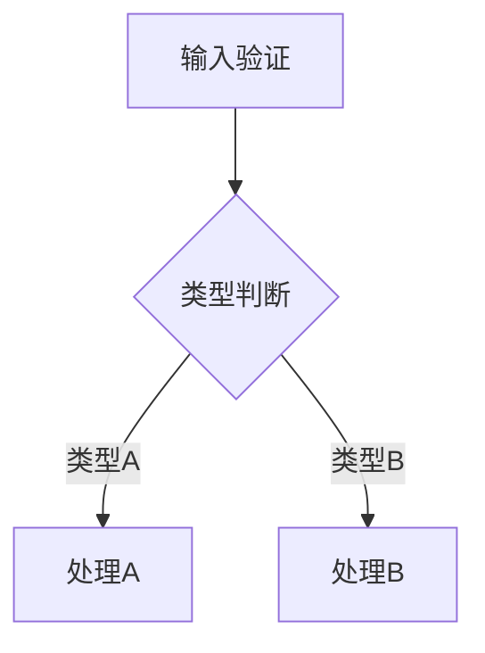

# Architecture Design Workflow

## 侧重点

- 用最少可审查信息完成 L2 架构闭环（边界/接口/数据流/关键决策）
- 所有关键决策必须可追溯（必要时落 ADR）

## 质量门控检查

> 完成架构设计后，必须执行以下门控检查：

| 检查项 | 通过标准 | 状态 |
|--------|----------|------|
| 架构图清晰 | 逻辑流程图/模块关系图可读 | [ ] |
| 接口定义完整 | 输入/输出/错误码定义完整 | [ ] |
| 与现有系统无冲突 | 不与现有架构/ADR冲突 | [ ] |
| 设计可行 | 技术方案可实现 | [ ] |
| 伪代码格式规范 | 使用标准Markdown格式，分层级描述 | [ ] |

**门控失败处理**：若任一检查项未通过，应记录失败原因并返回修正。

## 架构图绘制建议

> 对于复杂模块，建议使用mermaid绘制架构图：



## 触发条件

- 仅当需求已确认且需要产出 L2 架构设计时 → 必须调用本 Skill
- 仅当关键技术选型/约束存在缺口或冲突影响架构决策时 → 必须进入 `[USER_DECISION]`

## Input

- PRD（link 或内容）
- 关键约束（含安全/性能/合规）
- 目录结构（来自 `sop-code-explorer` 的 audit_report，可选）

## Workflow Steps

### Step 1: Concept Design (Directory-aware)

**Purpose**: Define system concepts with directory structure in mind

**Actions**:
1. Identify core concepts
2. Define boundaries aligned with directories
3. Map concepts to directory structure
4. Define relationships

### Step 2: Interface Definition

**Purpose**: Define system interfaces

**Actions**:
1. Define input/output
2. Specify data structures
3. Document error handling
4. Define cross-directory interfaces

### Step 3: Pseudocode

**Purpose**: Describe logic with structured, language-agnostic pseudocode

**Actions**:
1. **Define module layer**:
   - Use Markdown headings to identify module name and responsibility
   - Format: `### 2.1 模块层：[模块名称]`

2. **Write flow layer functions**:
   - Wrap main flow and sub-flows in function definitions
   - Use `lower_snake_case` for function names
   - Use standard Markdown code block with `text` identifier

3. **Define operation layer**:
   - Use atomic operations with `UPPER_SNAKE_CASE`
   - Include structured control flow (IF/END IF, FOR/END FOR)

4. **Add annotations**:
   - Explain "why" not "what"
   - Reference ADR for key decisions

**Output Format**:
```text
// 主流程：处理用户请求
FUNCTION process_request(input):
    // 输入验证是必要的前置条件
    VALIDATE_INPUT input
    
    IF input.type == "A":
        result = process_type_a(input)
    ELSE IF input.type == "B":
        result = process_type_b(input)
    ELSE:
        RAISE_ERROR "Invalid type"
    END IF
    
    RETURN result
END FUNCTION
```

**Pseudocode Standards**:

| 要求 | 说明 |
|------|------|
| 代码块格式 | 使用 `text` 或无标识符的标准 Markdown 代码块 |
| 缩进规范 | 4 空格缩进 |
| 语言无关 | 不使用特定编程语言语法 |

**Control Structures**:

```text
// 条件结构
IF condition:
    action
ELSE IF other_condition:
    other_action
ELSE:
    default_action
END IF

// 循环结构
FOR EACH item IN collection:
    process(item)
END FOR

// 异常处理
TRY:
    operation
CATCH error_type:
    handle_error
END TRY
```

**Naming Conventions**:

| 类型 | 格式 | 示例 |
|------|------|------|
| 原子操作 | `UPPER_SNAKE_CASE` | `VALIDATE_INPUT` |
| 函数 | `lower_snake_case` | `process_data` |
| 常量 | `UPPER_SNAKE_CASE` | `MAX_RETRY_COUNT` |

### Step 4: Decision Records (ADR)

**Purpose**: Document key architecture decisions in L4

**Actions**:
1. **Identify decisions requiring ADR**:
   - Technology stack selection
   - Architecture pattern changes
   - Major interface design decisions
   - Performance optimization strategies
   - Security scheme decisions
   - Any decision with >2 alternatives

2. **Option survey (before deciding)**:
   - For each key decision, collect >=2 options
   - Compare: constraints, risks, cost, operational complexity, maintainability
   - If using external docs/best practices, save to RAG and reference in ADR（参见 04_reference/knowledge_management.md）

3. **Create ADR for each key decision**:
   - Location: `docs/04_context_reference/adr_[module]_[topic].md`（参见 04_reference/document_directory_mapping.md）
   - Use template from `04_reference/document_templates/adr.md`
   - Link to L2 pseudo code

4. **Document in pseudo code**:
   - Add ADR reference comment
   - Example: `// ADR-001: Authentication scheme`

5. **Check RAG references**:
   - Review `docs/04_context_reference/rag/` for relevant info（参见 04_reference/document_directory_mapping.md）
   - Reference external knowledge in ADR
   - Mark `[USER_DECISION]` if conflict found

ADR 触发规则（任一满足即需要 ADR）：技术选型 / 架构模式 / 关键接口 / 安全方案 / 性能策略 / >2 个可选项

### Step 5: Gate Check

**Purpose**: Execute quality gate check for architecture phase

**Actions**:
CMD: `GATE_CHECK(architecture_doc, gate='GATE_ARCHITECTURE')`

**Gate Check Items**:
| 检查项 | 通过标准 | 状态 |
|--------|----------|------|
| 架构图清晰 | 逻辑流程图/模块关系图可读 | [ ] |
| 接口定义完整 | 输入/输出/错误码定义完整 | [ ] |
| 与现有系统无冲突 | 不与现有架构/ADR冲突 | [ ] |
| 设计可行 | 技术方案可实现 | [ ] |

**State Transition**:
- 通过 → `[WAITING_FOR_ARCHITECTURE]`
- 失败 → `[GATE_FAILED]` → 用户决策

## 来源与依赖准则

- 必须声明输入来源与依赖（PRD/约束/参考资料等），并优先用 `TRACE_SOURCES(inputs)` 固化"来源与依赖声明"
- 当关键来源缺失或冲突无法消解时，必须进入 `[USER_DECISION]`，并使用 `RECORD_DECISION(topic, decision)` 落盘决策记录
- 标准：04_reference/review_standards/source_dependency.standard.md

## Output

- 模板：04_reference/document_templates/architecture_design.md
- ADR 模板：04_reference/document_templates/adr.md
- Stop: `[WAITING_FOR_ARCHITECTURE]`
- CMD: `ARCH_DESIGN(prd)`

## Stop Points

- `[WAITING_FOR_ARCHITECTURE]`: 架构设计已落盘，等待确认或进入审查
- `[USER_DECISION]`: 关键技术选型/约束依据不足或冲突不可消解

## Constraints

- Technology-agnostic
- Reusable across projects
- Clear interfaces
- Documented decisions
- **Directory-aware design**
- **Concept-to-directory mapping**
- **Standard Markdown pseudocode format**

## Spec 模式约束

- **规划阶段只读**: 在 Spec 模式规划阶段，本 Skill 仅执行只读分析，不进行实际代码修改
- **交互式提问**: 当检测到决策点时，必须通过 AskUserQuestion 向用户提问
- **冲突检测**: 执行前必须检测与现有 ADR/设计文档的冲突，参考 04_reference/conflict_detection_rules.md
- **决策记录**: 重要决策必须记录到 spec.md 的决策记录章节
- **ADR 引用**: 本 Skill 涉及的 ADR 文档：ADR-Spec-001（生命周期）、ADR-Spec-002（设计关系）、ADR-Spec-004（交互式提问）
