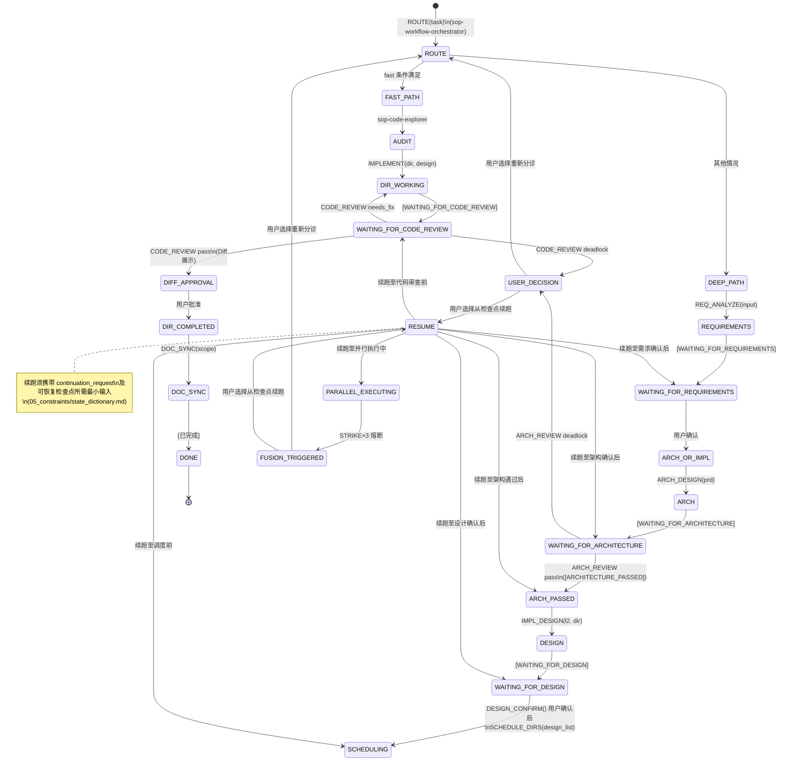
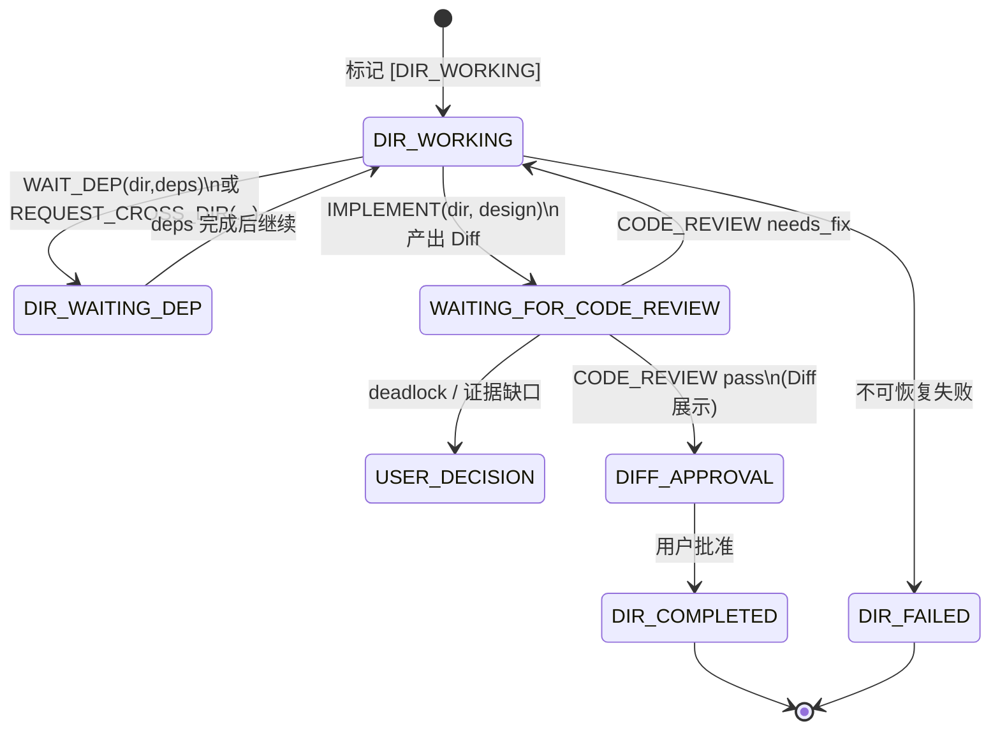
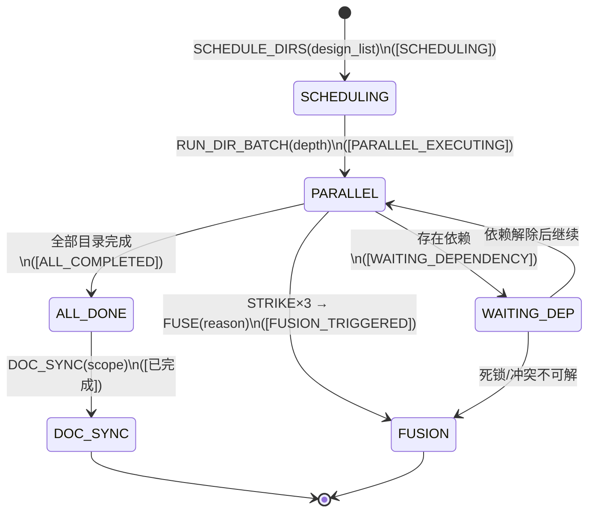
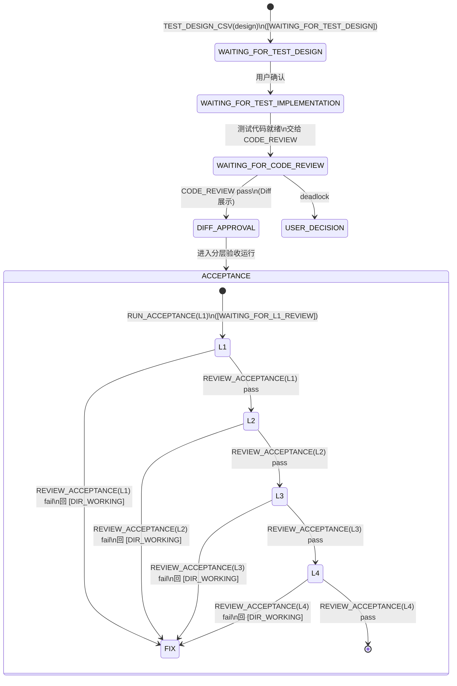

# SOP 状态机（skills / prompts / workflow 统一视图）

## 目的

本文件把 `docs/参考/sop` 的技能（skills）、提示词（prompts/packs/default）、流程（03_workflow）在状态维度上统一成“可审查的状态机”，用于：

- 快速判断当前处于哪个停止点、下一步应该调用哪个 Skill
- 让 LLM 在不加载引用正文的情况下先做分诊（渐进式披露）
- 为审查与治理提供稳定的 From → Trigger → To 证据链

## SSOT（唯一真源）

- 状态字典：`docs/参考/sop/05_constraints/state_dictionary.md`
- 命令字典（转移触发的 DSL）：`docs/参考/sop/05_constraints/command_dictionary.md`
- 工作流编排：`docs/参考/sop/03_workflow/index.md`
- Skill 合约：`docs/参考/sop/skills/*/SKILL.md`
- Prompt Pack（偏好层）：`docs/参考/sop/prompts/packs/default/*`

---

## 状态分类（按 SSOT）

### 全局停止点（Global Stop Points）

- `[WAITING_FOR_REQUIREMENTS]`
- `[WAITING_FOR_ARCHITECTURE]`
- `[WAITING_FOR_DESIGN]`
- `[USER_DECISION]`

### 代码审查停止点（Code Review Stop Points）

- `[WAITING_FOR_CODE_REVIEW]`
- `Diff展示`（人工确认点）

### 测试相关停止点（Test Stop Points）

- `[WAITING_FOR_TEST_DESIGN]`
- `[WAITING_FOR_TEST_IMPLEMENTATION]`
- `[WAITING_FOR_TEST_CREATION]`

### 分层验收审查点（L1-L4 Review Points）

- `[WAITING_FOR_L1_REVIEW]` / `[WAITING_FOR_L2_REVIEW]` / `[WAITING_FOR_L3_REVIEW]` / `[WAITING_FOR_L4_REVIEW]`

### 目录执行状态（Directory Execution States）

- `[DIR_WORKING]`
- `[DIR_WAITING_DEP]`
- `[DIR_COMPLETED]`
- `[DIR_FAILED]`

### 依赖与调度状态（Dependency & Scheduling）

- `[WAITING_FOR_WORKER]`（跨目录依赖请求条目等待处理）
- `[SCHEDULING]` / `[PARALLEL_EXECUTING]` / `[WAITING_DEPENDENCY]` / `[ALL_COMPLETED]`
- `[FUSION_TRIGGERED]`（三错熔断）
- `[已完成]`（收尾终态）

---

## 关键转移（From → Trigger/CMD → To）

以命令字典为主（`05_constraints/command_dictionary.md`），下表只列“决定流程走向”的关键转移：

| From | Trigger（CMD/事件） | To | 主体 |
|---|---|---|---|
| - | `ROUTE(task)` | - | sop-workflow-orchestrator |
| - | `REQ_ANALYZE(input)` | `[WAITING_FOR_REQUIREMENTS]` | sop-requirement-analyst |
| `[WAITING_FOR_REQUIREMENTS]` | `REQ_CONFIRM()`（用户） | - | 用户 |
| - | `ARCH_DESIGN(prd)` | `[WAITING_FOR_ARCHITECTURE]` | sop-architecture-design |
| `[WAITING_FOR_ARCHITECTURE]` | `ARCH_REVIEW(l2)` pass | `[ARCHITECTURE_PASSED]` | sop-architecture-reviewer |
| `[WAITING_FOR_ARCHITECTURE]` | `ARCH_REVIEW(l2)` deadlock | `[USER_DECISION]` | sop-architecture-reviewer |
| `[ARCHITECTURE_PASSED]` | `IMPL_DESIGN(l2, dir)` | `[WAITING_FOR_DESIGN]` | sop-implementation-designer |
| `[WAITING_FOR_DESIGN]` | `DESIGN_CONFIRM()`（用户） | - | 用户 |
| - | `SCHEDULE_DIRS(design_list)` | `[SCHEDULING]` | sop-progress-supervisor |
| `[SCHEDULING]` | `RUN_DIR_BATCH(depth)` | `[PARALLEL_EXECUTING]`（监督视角） | sop-progress-supervisor |
| - | `WAIT_DEP(dir, deps)` | `[DIR_WAITING_DEP]` | sop-code-implementation |
| - | `IMPLEMENT(dir, design)` | `[WAITING_FOR_CODE_REVIEW]` | sop-code-implementation |
| `[WAITING_FOR_CODE_REVIEW]` | `CODE_REVIEW(diff, refs)` pass | `Diff展示` | sop-code-review |
| `Diff展示` | 用户批准 | `[DIR_COMPLETED]` | 用户 |
| `[WAITING_FOR_CODE_REVIEW]` | `CODE_REVIEW(...)` needs_fix | `[DIR_WORKING]` | sop-code-review |
| `[WAITING_FOR_CODE_REVIEW]` | `CODE_REVIEW(...)` deadlock | `[USER_DECISION]` | sop-code-review |
| - | `TEST_DESIGN_CSV(design)` | `[WAITING_FOR_TEST_DESIGN]` | sop-test-design-csv |
| - | `TEST_IMPLEMENT(test_design)` | `[WAITING_FOR_TEST_IMPLEMENTATION]` | sop-test-implementation |
| - | `RUN_ACCEPTANCE(Lx)` | `[WAITING_FOR_Lx_REVIEW]` | sop-code-implementation |
| `[WAITING_FOR_Lx_REVIEW]` | `REVIEW_ACCEPTANCE(Lx)` fail | `[DIR_WORKING]` | sop-code-review |
| - | `DOC_SYNC(scope)` | `[已完成]` | sop-document-sync |
| - | `STRIKE(record)`×3 → `FUSE(reason)` | `[FUSION_TRIGGERED]` | sop-progress-supervisor |

---

## 状态机图（Mermaid）

### 1) 任务级总状态机（单入口分诊 → 收尾）

说明：`[WAITING_FOR_DESIGN]` 至 `SCHEDULING` 的转移须在用户执行 `DESIGN_CONFIRM()` 确认设计后进行；design_list 由 sop-code-explorer 在进入调度前产出（参见 AGENT_SOP 目录并行执行流程）。`[USER_DECISION]` / `[FUSION_TRIGGERED]` 后可选择重新分诊或从可恢复检查点续跑；可恢复检查点清单见 05_constraints/state_dictionary.md。

### 2) 目录级子状态机（实现 → 审查 → 人工确认 → 完成）

### 3) 调度/监督视角子状态机（多目录并行）

### 4) TDD/分层验收子状态机（叠加）

---

## 渐进式披露（LLM/人类的最小加载策略）

- 仅需判断下一步：只看“状态分类 + 关键转移表”。
- 需要执行细节：再按 SSOT 下钻到 `state_dictionary.md`、`command_dictionary.md`、对应 `skills/*/SKILL.md`。
- 需要表达偏好/输出风格：最后才加载 `prompts/packs/default/*`。
