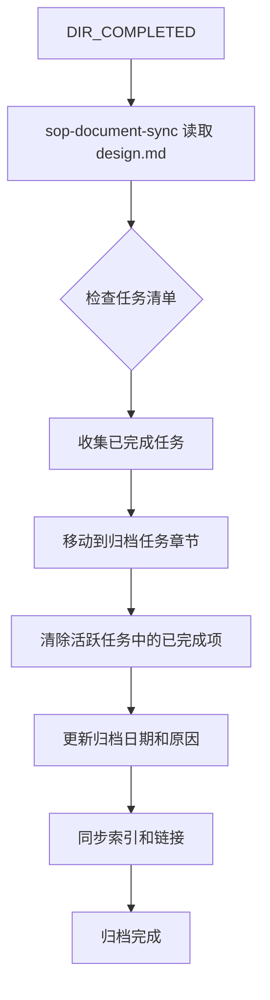

# SOP 文档组改进执行计划

## 1. 改进目标

基于审查报告的发现，对SOP文档组进行以下改进：

1. **入口统一**：合并 `LLM_INDEX.md` 到 `AGENT_SOP.md` 作为唯一入口
2. **角色定位**：`sop_for_human.md` 标记为仅供参考
3. **任务管理增强**：改进 `design.md` 模板，支持任务清单、状态标记和归档清除

## 2. 改进项详情

### 2.1 入口统一（优先级：高）

#### 当前状态

| 文件 | 角色 | 问题 |
|------|------|------|
| `LLM_INDEX.md` | LLM精简入口 | 与AGENT_SOP.md功能重叠 |
| `AGENT_SOP.md` | Agent执行入口 | 内容较详细 |
| `sop_for_human.md` | 人类阅读版 | 定位不明确 |

#### 目标状态

```
AGENT_SOP.md（唯一入口）
├── 快速分诊（来自LLM_INDEX.md）
├── 核心约束
├── 路径选择
├── Skill指令
├── 工作流
└── 导航

sop_for_human.md（仅供参考）
└── 人类友好的叙述化说明
```

#### 实施步骤

1. 将 `LLM_INDEX.md` 的"快速分诊"章节合并到 `AGENT_SOP.md` 开头
2. 在 `AGENT_SOP.md` 开头添加"使用方式"说明
3. 删除 `LLM_INDEX.md` 文件
4. 更新所有引用 `LLM_INDEX.md` 的文档

### 2.2 design.md 任务管理增强（优先级：高）

#### 当前状态

```markdown
## 6. 任务清单
- [ ] [任务1: 对应L2的某个原子操作]
- [ ] [任务2]
- [ ] [任务3]
```

**问题**：
- 任务清单格式简单，缺乏状态追踪
- 无任务ID，难以跨文档引用
- 无归档机制，完成后任务清单仍保留

#### 目标状态

```markdown
## 6. 任务清单

### 任务状态说明
| 状态 | 标记 | 含义 |
|------|------|------|
| 待处理 | `[ ]` | 任务尚未开始 |
| 进行中 | `[-]` | 任务正在执行 |
| 已完成 | `[x]` | 任务已完成并通过验证 |
| 已阻塞 | `[!]` | 任务被阻塞，需外部依赖 |
| 已归档 | `[ archived ]` | 任务已归档，不在活跃清单显示 |

### 活跃任务

| 任务ID | 描述 | 状态 | 依赖 | 产出物 | 完成日期 |
|--------|------|------|------|--------|----------|
| T001 | 实现用户认证模块 | `[x]` | - | auth.ts | 2026-02-10 |
| T002 | 实现权限校验逻辑 | `[-]` | T001 | permission.ts | - |
| T003 | 集成第三方OAuth | `[!]` | T002, 外部API | oauth.ts | - |
| T004 | 编写单元测试 | `[ ]` | T001, T002 | *.test.ts | - |

### 归档任务

> 归档操作由 `sop-document-sync` 在目录归档时自动执行

| 任务ID | 描述 | 原状态 | 归档日期 | 归档原因 |
|--------|------|--------|----------|----------|
| T000 | 初始化项目结构 | `[x]` | 2026-02-08 | 目录归档同步 |
```

#### 新增命令

在 `05_constraints/command_dictionary.md` 中添加：

| CMD | 主体 | args | out | pre | post |
|-----|------|------|-----|-----|------|
| `TASK_START(task_id)` | sop-code-implementation | task_id | task_status | - | `[-]` |
| `TASK_COMPLETE(task_id)` | sop-code-implementation | task_id | task_status | 验证通过 | `[x]` |
| `TASK_BLOCK(task_id, reason)` | sop-code-implementation | task_id, reason | task_status | - | `[!]` |
| `TASK_ARCHIVE(dir)` | sop-document-sync | dir | archived_tasks | `[DIR_COMPLETED]` | 归档清单更新 |

#### 新增状态

在 `05_constraints/state_dictionary.md` 中添加：

| 状态 | 触发者 | 含义 | 继续条件 |
|------|--------|------|----------|
| `[TASK_BLOCKED]` | sop-code-implementation | 任务被阻塞 | 依赖解决后手动解除 |
| `[TASK_COMPLETED]` | sop-code-implementation | 任务完成 | 自动进入下一任务 |

### 2.3 归档操作规范（优先级：中）

#### 触发条件

当目录状态从 `[DIR_WORKING]` 变为 `[DIR_COMPLETED]` 时，`sop-document-sync` 执行归档操作。

#### 归档流程



#### 归档规则

| 规则 | 说明 |
|------|------|
| 仅归档已完成任务 | 状态为 `[x]` 的任务移入归档 |
| 保留未完成任务 | 状态为 `[ ]`、`[-]`、`[!]` 的任务保留在活跃清单 |
| 记录归档元数据 | 归档日期、归档原因（目录归档同步） |
| 清理产出物引用 | 归档后产出物路径移至历史记录 |

### 2.4 sop-document-sync Skill 更新

#### 新增职责

```markdown
### Step N: Task Archive

**Purpose**: Archive completed tasks when directory is completed

**Actions**:
1. Read design.md in completed directory
2. Identify tasks with status `[x]`
3. Move completed tasks to "归档任务" section
4. Update archive metadata (date, reason)
5. Clear completed tasks from "活跃任务" section
6. Update document index

CMD: `TASK_ARCHIVE(dir) -> archived_tasks`
```

## 3. 实施计划

### 3.1 任务分解

| 序号 | 任务 | 负责模式 | 优先级 | 依赖 |
|------|------|----------|--------|------|
| 1 | 合并LLM_INDEX.md到AGENT_SOP.md | Code | 高 | - |
| 2 | 更新sop_for_human.md添加"仅供参考"标记 | Code | 高 | - |
| 3 | 更新design.md模板添加任务管理章节 | Code | 高 | - |
| 4 | 更新状态字典添加任务相关状态 | Code | 高 | 3 |
| 5 | 更新命令字典添加任务相关命令 | Code | 高 | 3 |
| 6 | 更新sop-document-sync SKILL.md | Code | 中 | 4, 5 |
| 7 | 更新sop-code-implementation SKILL.md | Code | 中 | 4, 5 |
| 8 | 删除LLM_INDEX.md | Code | 高 | 1 |
| 9 | 更新所有引用LLM_INDEX.md的文档 | Code | 高 | 8 |
| 10 | 验证文档一致性 | Architect | 中 | 全部 |

### 3.2 文件变更清单

| 文件 | 操作 | 说明 |
|------|------|------|
| `AGENT_SOP.md` | 修改 | 合并LLM_INDEX.md内容 |
| `LLM_INDEX.md` | 删除 | 合并后删除 |
| `sop_for_human.md` | 修改 | 添加"仅供参考"标记 |
| `04_reference/document_templates/implementation_design.md` | 修改 | 增强任务管理章节 |
| `05_constraints/state_dictionary.md` | 修改 | 添加任务状态 |
| `05_constraints/command_dictionary.md` | 修改 | 添加任务命令 |
| `skills/sop-document-sync/SKILL.md` | 修改 | 添加归档步骤 |
| `skills/sop-code-implementation/SKILL.md` | 修改 | 添加任务状态更新 |
| `01_concept_overview.md` | 修改 | 更新导航链接 |
| `ROLE_CHEATSHEET.md` | 修改 | 更新引用链接 |
| `SOP_REVIEW_REPORT.md` | 修改 | 更新引用链接 |
| `PROMPT_SKILL_CONSISTENCY_REPORT.md` | 修改 | 更新引用链接 |

### 3.3 版本更新

改进完成后，版本号从 `v2.0.0` 升级为 `v2.1.0`（新增功能）。

## 4. 风险评估

| 风险 | 等级 | 缓解措施 |
|------|------|----------|
| 入口变更导致用户困惑 | 中 | 在AGENT_SOP.md开头添加明确的使用说明 |
| 任务管理增加复杂度 | 低 | 保持向后兼容，简单任务可省略 |
| 归档操作遗漏 | 低 | 在sop-document-sync中强制执行 |

## 5. 验收标准

| 标准 | 验证方法 |
|------|----------|
| AGENT_SOP.md包含原LLM_INDEX.md所有内容 | 文本对比 |
| 无文档引用已删除的LLM_INDEX.md | 正则搜索 |
| design.md模板包含完整的任务管理章节 | 模板检查 |
| 状态字典包含任务相关状态 | 内容检查 |
| 命令字典包含任务相关命令 | 内容检查 |
| sop-document-sync包含归档步骤 | Skill合约检查 |

## 6. 审批

请确认是否批准此改进计划，或提出修改意见。

---

**审批状态**: ⏳ 待审批

**审批人**: ________________

**审批日期**: ________________
