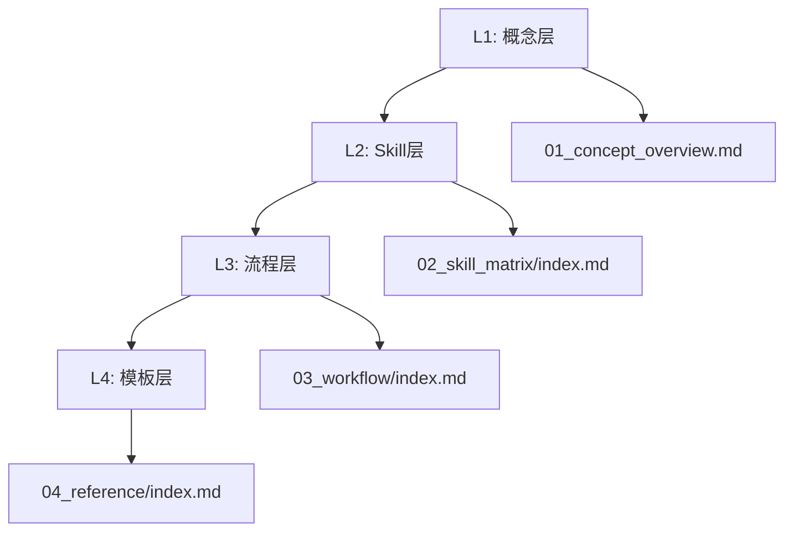
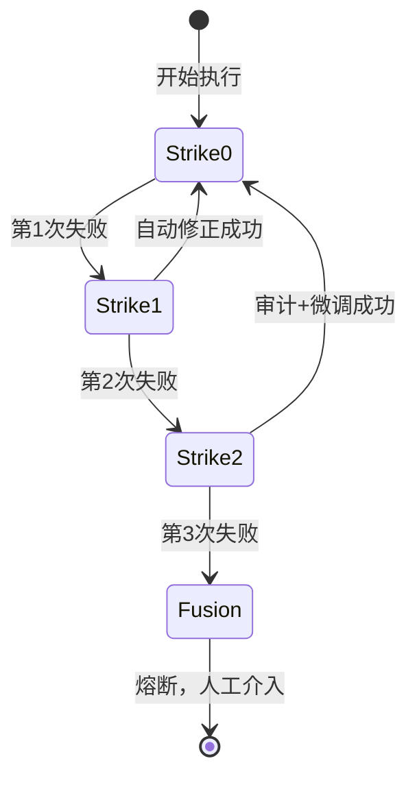

# SOP 文档组全面审查报告

## 1. 审查概述

### 1.1 审查目标

对 `docs/参考/sop` 文档组进行全面审查，评估其作为"生产可用的基于文档的AI编程工作流"的适用性，重点关注：

1. 渐进披露机制的有效性
2. 工程化约束对LLM发散和幻觉的限制效果
3. 文档间一致性与引用完整性
4. 生产可用性评估

### 1.2 审查范围

| 目录 | 文件数 | 说明 |
|------|--------|------|
| 根目录 | 8 | 入口文档与索引 |
| 02_skill_matrix | 1 | Skill矩阵(SSOT) |
| 03_workflow | 4 | 工作流规范 |
| 04_reference | 20+ | 模板、交互格式、审查标准 |
| 05_constraints | 7 | 约束字典与禁止项矩阵 |
| prompts/packs/default | 19 | 默认Prompt Pack |
| skills | 17 | Skill合约定义 |
| Review/reviews | 15 | 历史审查记录 |

### 1.3 审查结论

**总体评价：生产就绪（Pass with Recommendations）**

该文档组设计完善，具备生产可用的基础。SSOT收敛良好，工程化约束机制完整，渐进披露设计合理。存在少量改进建议，但不影响核心功能。

---

## 2. 架构设计评估

### 2.1 渐进披露机制（L1-L4）



| 层级 | 文档 | 信息密度 | 跳数限制 | 评估 |
|------|------|----------|----------|------|
| L1 | [`01_concept_overview.md`](01_concept_overview.md) | 低 | ≤3 | ✅ 符合 |
| L2 | [`02_skill_matrix/index.md`](02_skill_matrix/index.md) | 中 | ≤3 | ✅ 符合 |
| L3 | [`03_workflow/index.md`](03_workflow/index.md) | 中高 | ≤3 | ✅ 符合 |
| L4 | [`04_reference/index.md`](04_reference/index.md) | 高 | ≤3 | ✅ 符合 |

**评估结论**：渐进披露设计合理，从概念到模板逐层深入，每层都有明确的职责边界。LLM可在不加载全文的情况下进行分诊判断。

### 2.2 SSOT收敛评估

| SSOT类型 | 文档位置 | 引用一致性 | 评估 |
|----------|----------|------------|------|
| Skill清单 | [`02_skill_matrix/index.md`](02_skill_matrix/index.md) | ✅ 全局统一引用 | 通过 |
| 状态字典 | [`05_constraints/state_dictionary.md`](05_constraints/state_dictionary.md) | ✅ 全局统一引用 | 通过 |
| 命令字典 | [`05_constraints/command_dictionary.md`](05_constraints/command_dictionary.md) | ✅ 全局统一引用 | 通过 |
| 禁止项矩阵 | [`05_constraints/constraint_matrix.md`](05_constraints/constraint_matrix.md) | ✅ 全局统一引用 | 通过 |

**评估结论**：SSOT收敛完成，所有状态、命令、约束均可追溯到唯一真源。

### 2.3 多入口设计

| 入口 | 目标用户 | 设计意图 |
|------|----------|----------|
| [`LLM_INDEX.md`](LLM_INDEX.md) | LLM Agent | 精简索引，最小token消耗 |
| [`AGENT_SOP.md`](AGENT_SOP.md) | 执行Agent | 约束+指令+导航 |
| [`sop_for_human.md`](sop_for_human.md) | 人类用户 | 叙述化说明 |
| [`ROLE_CHEATSHEET.md`](ROLE_CHEATSHEET.md) | 快速查询 | 速查表 |

**评估结论**：多入口设计满足不同使用场景，LLM友好性良好。

---

## 3. 工程化约束评估

### 3.1 LLM发散限制机制

#### 3.1.1 三错即停机制



| Strike | 条件 | 行动 | 限制效果 |
|--------|------|------|----------|
| 1 | 同一Skill同一步骤失败 | 自动修正 | 允许有限重试 |
| 2 | 再失败 | 审计+微调 | 引入人工判断 |
| 3 | 再失败 | **熔断** | 强制停止，防止无限循环 |

**评估结论**：三错即停机制有效防止LLM在错误方向上无限重试，是限制发散的关键机制。

#### 3.1.2 状态先行约束

| 约束 | 规则 | 违反后果 |
|------|------|----------|
| 状态标记 | 先标记`[DIR_WORKING]`，再执行操作 | 状态混乱，无法追踪 |
| 状态流转 | `[DIR_WORKING]`→`[DIR_COMPLETED]` | 虚假进度 |

**评估结论**：状态先行约束确保执行过程可追踪、可审计。

#### 3.1.3 目录边界约束

```
Scope = design.md所在目录及其子目录（不含嵌套design.md的子目录）
```

| 约束 | 规则 | 限制效果 |
|------|------|----------|
| 目录隔离 | 仅修改当前Scope内文件 | 防止越界修改 |
| 依赖等待 | 跨目录依赖进入`[DIR_WAITING_DEP]` | 强制协调 |
| 自底向上 | 按目录深度从深到浅执行 | 确保依赖满足 |

**评估结论**：目录边界约束有效限制LLM的修改范围，防止"蝴蝶效应"式的大范围修改。

### 3.2 幻觉限制机制

#### 3.2.1 来源与依赖声明

```markdown
### 0. 来源与依赖声明
> 必须引用 Source and Dependency 标准格式
```

所有设计文档模板均要求声明来源与依赖，当找不到来源或依赖时：

1. 必须中断并进入`[USER_DECISION]`
2. 必须落盘决策记录到`docs/04_context_reference/decisions/`

**评估结论**：来源与依赖声明机制强制LLM追溯依据，有效减少"凭空生成"的幻觉内容。

#### 3.2.2 测试资产隔离

| 资产类型 | 维护Skill | 禁止操作 |
|----------|-----------|----------|
| CSV测试用例 | sop-test-design-csv | 其他Skill修改 |
| 测试代码 | sop-test-implementation | 其他Skill修改 |

**设计意图**：
- 测试设计仅基于设计文档，不参考代码 → 防止"从代码倒推测试"的偏见
- 测试实现仅读取CSV，不修改CSV → 确保测试设计的独立性

**评估结论**：测试资产隔离机制有效防止LLM"自我验证"的幻觉循环。

#### 3.2.3 审查分离

| Skill | 职责 | 禁止 |
|-------|------|------|
| sop-code-review | 输出审查报告 | 修改任何代码 |
| sop-architecture-reviewer | 输出架构审查报告 | 直接修改架构文档 |

**评估结论**：审查与执行分离，确保审查的独立性和客观性。

### 3.3 约束执行机制

#### 3.3.1 禁止项矩阵

| 等级 | 违规类型 | 处理方式 |
|------|----------|----------|
| 🟡 轻微 | 格式不规范 | 提醒修正 |
| 🟠 中度 | 跳过停止点 | 阻止操作 |
| 🔴 严重 | 修改SOP/破坏测试独立 | **熔断** |

**评估结论**：分级处理机制合理，既保证灵活性又确保关键约束不可违反。

#### 3.3.2 命令式交互

```
CMD: `IMPLEMENT(dir, design)` -> code_changes | pre:[ARCHITECTURE_PASSED] | post:[WAITING_FOR_CODE_REVIEW]
```

**设计特点**：
- 使用DSL表达步骤，减少自然语言歧义
- 明确前置条件和后置状态
- 便于验证和审计

**评估结论**：命令式交互设计减少LLM理解歧义，提高执行准确性。

---

## 4. Skill体系评估

### 4.1 Skill矩阵完整性

| 类别 | Skill数量 | 覆盖范围 |
|------|-----------|----------|
| 编排类 | 2 | sop-workflow-orchestrator, sop-code-explorer |
| 需求类 | 1 | sop-requirement-analyst |
| 设计类 | 3 | sop-architecture-design, sop-architecture-reviewer, sop-implementation-designer |
| 实现类 | 2 | sop-code-implementation, sop-test-implementation |
| 质量类 | 2 | sop-code-review, sop-test-design-csv |
| 监管类 | 2 | sop-progress-supervisor, sop-document-sync |
| 路径宏 | 3 | sop-fast-path, sop-deep-path, sop-tdd-workflow |
| 辅助类 | 2 | sop-capability-reuse, sop-design-placement |

**评估结论**：Skill覆盖完整，从需求到交付的全流程均有对应Skill。

### 4.2 Skill合约规范性

抽查关键Skill合约（[`sop-code-implementation`](skills/sop-code-implementation/SKILL.md)、[`sop-workflow-orchestrator`](skills/sop-workflow-orchestrator/SKILL.md)、[`sop-progress-supervisor`](skills/sop-progress-supervisor/SKILL.md)）：

| 合约要素 | 完整性 | 评估 |
|----------|--------|------|
| 触发条件 | ✅ 明确 | 通过 |
| Input定义 | ✅ 完整 | 通过 |
| Workflow Steps | ✅ 步骤清晰 | 通过 |
| Output定义 | ✅ 模板引用 | 通过 |
| Constraints | ✅ 边界明确 | 通过 |
| Stop Points | ✅ 状态引用 | 通过 |
| 3-Strike Rule | ✅ 定义清晰 | 通过 |

**评估结论**：Skill合约规范完整，可执行性强。

### 4.3 Prompt Pack与Skill一致性

| 检查项 | 状态 | 说明 |
|--------|------|------|
| Skill矩阵中每个Skill均有对应Prompt | ✅ | 17个Skill均有对应 |
| Prompt仅表达偏好，不重写合约 | ✅ | 符合设计原则 |
| 状态/命令引用统一指向字典 | ✅ | SSOT收敛 |

**评估结论**：Prompt Pack与Skill分离设计合理，偏好层与合约层解耦。

---

## 5. 文档一致性评估

### 5.1 版本一致性

| 文档 | 版本号 | 更新日期 | 一致性 |
|------|--------|----------|--------|
| 核心文档 | v2.0.0 | 2026-02-12 | ✅ |
| Skill合约 | v2.0.0 | 2026-02-12 | ✅ |
| Prompt Pack | v2.0.0 | 2026-02-12 | ✅ |
| 约束文档 | v2.0.0 | 2026-02-12 | ✅ |

**评估结论**：版本号统一，便于追溯。

### 5.2 引用完整性

通过正则搜索验证71处内部链接：

| 检查项 | 结果 |
|--------|------|
| 相对路径引用 | ✅ 格式正确 |
| 跨目录引用 | ✅ 路径有效 |
| SSOT引用 | ✅ 统一指向字典 |

**注意**：[`LLM_INDEX.md`](LLM_INDEX.md)中引用的[`sop_state_machine.md`](../sop_state_machine.md)位于父目录，路径正确。

### 5.3 术语一致性

| 术语 | 使用情况 | 评估 |
|------|----------|------|
| Skill | 统一使用 | ✅ |
| Scope | 统一使用 | ✅ |
| 停止点 | 统一使用 | ✅ |
| 熔断 | 统一使用 | ✅ |
| SSOT | 统一使用 | ✅ |

**评估结论**：术语使用一致，无旧术语残留。

---

## 6. 生产可用性评估

### 6.1 优势

| 优势 | 说明 |
|------|------|
| **SSOT收敛** | 状态/命令/约束均可追溯，避免"多头管理" |
| **渐进披露** | LLM可按需加载，减少token消耗 |
| **工程化约束** | 三错即停、状态先行、目录边界等机制完善 |
| **测试隔离** | CSV与测试代码分离，防止自我验证 |
| **多入口设计** | 满足LLM/人类/快速查询等多种场景 |
| **命令式交互** | DSL减少自然语言歧义 |

### 6.2 改进建议

| 编号 | 建议 | 优先级 | 说明 |
|------|------|--------|------|
| 1 | 补充sop-capability-reuse的SKILL.md | 🟡 中 | Skill矩阵中列出但skills目录中缺失 |
| 2 | 添加缺陷等级表到SSOT | 🟢 低 | 当前使用🔴🟠🟡🟢但未正式定义 |
| 3 | 添加命名规范到SSOT | 🟢 低 | 文件/目录命名规范未显式定义 |
| 4 | 添加目录深度阈值 | 🟢 低 | design.md嵌套深度限制未定义 |

### 6.3 风险评估

| 风险 | 等级 | 缓解措施 |
|------|------|----------|
| LLM不遵守约束 | 中 | 三错即停+熔断机制 |
| 状态漂移 | 低 | SSOT收敛+状态字典 |
| 测试偏见 | 低 | 测试资产隔离 |
| 跨目录依赖死锁 | 中 | sop-progress-supervisor协调 |

---

## 7. 审查结论

### 7.1 总体评价

该SOP文档组设计完善，具备以下核心能力：

1. **渐进披露机制**：L1-L4层级设计合理，LLM可按需加载
2. **工程化约束**：三错即停、状态先行、目录边界等机制有效限制LLM发散
3. **幻觉限制**：来源依赖声明、测试隔离、审查分离等机制减少幻觉
4. **SSOT收敛**：状态/命令/约束均可追溯，避免多头管理

### 7.2 发布建议

**建议：发布就绪（Pass with Recommendations）**

- 核心功能完整，可投入生产使用
- 建议在后续版本中补齐改进建议中的内容
- 建议定期审查并更新审查记录

### 7.3 后续行动

| 行动项 | 负责方 | 优先级 |
|--------|--------|--------|
| 补充sop-capability-reuse SKILL.md | Librarian | 中 |
| 添加缺陷等级表到约束文档 | Librarian | 低 |
| 添加命名规范到约束文档 | Librarian | 低 |
| 定期审查更新 | Oracle | 持续 |

---

## 8. 附录

### 8.1 审查方法

- 静态分析：全量文档扫描
- 引用检查：正则匹配内部链接
- 一致性校验：版本号、术语、SSOT引用
- 抽样审查：关键Skill合约、Prompt Pack

### 8.2 参考文档

- [SOP审查报告](SOP_REVIEW_REPORT.md)
- [Prompt/Skill一致性报告](PROMPT_SKILL_CONSISTENCY_REPORT.md)
- [历史审查记录](Review/20260212/05_review_report.md)
